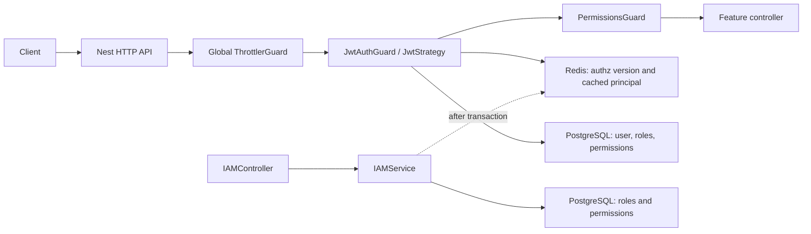
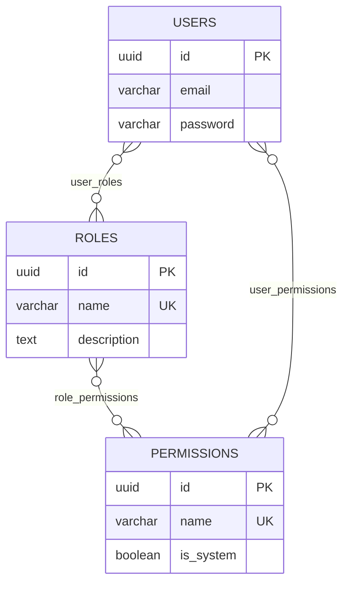
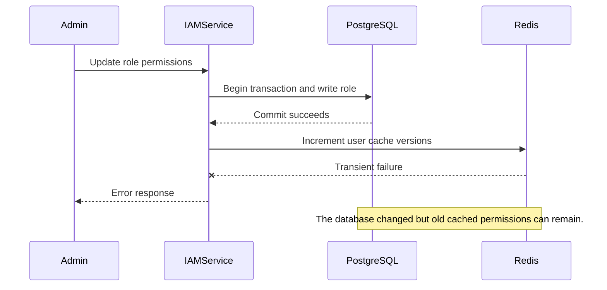
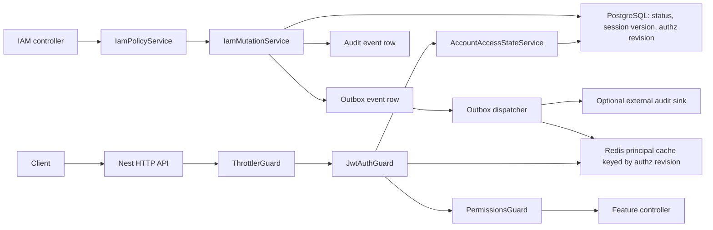
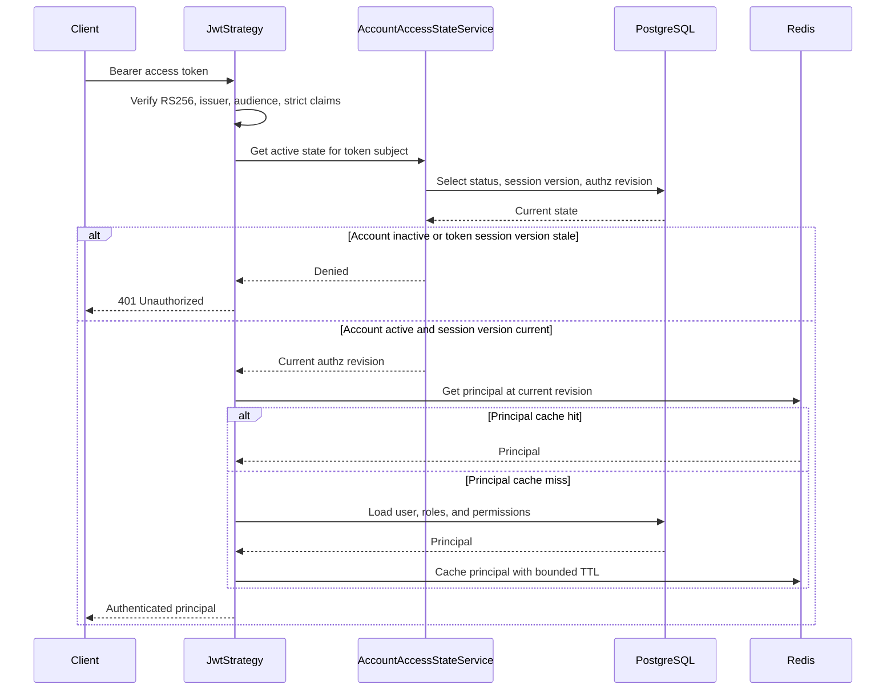
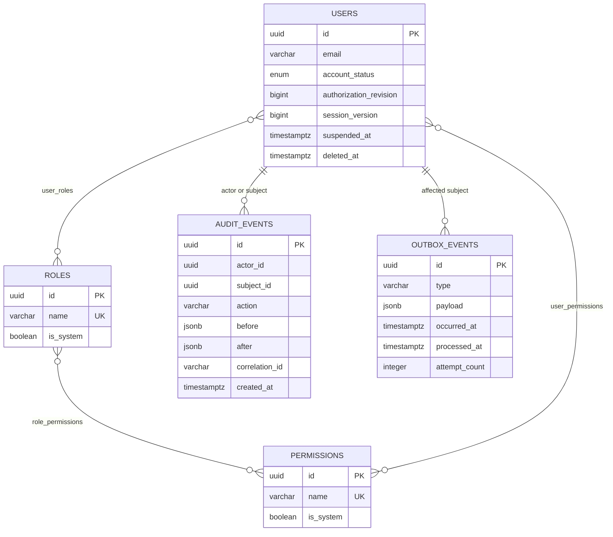
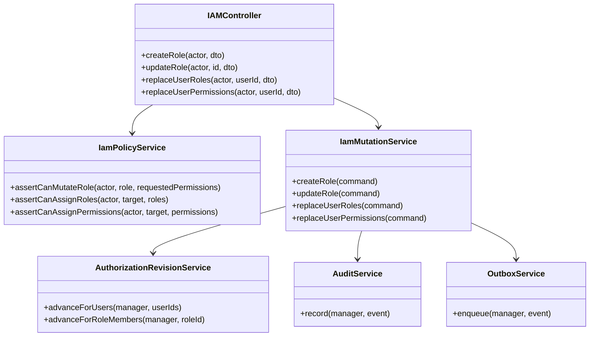
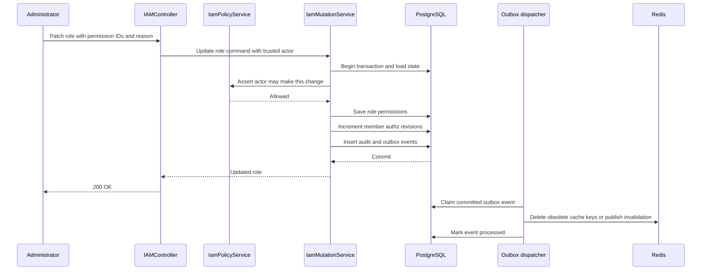
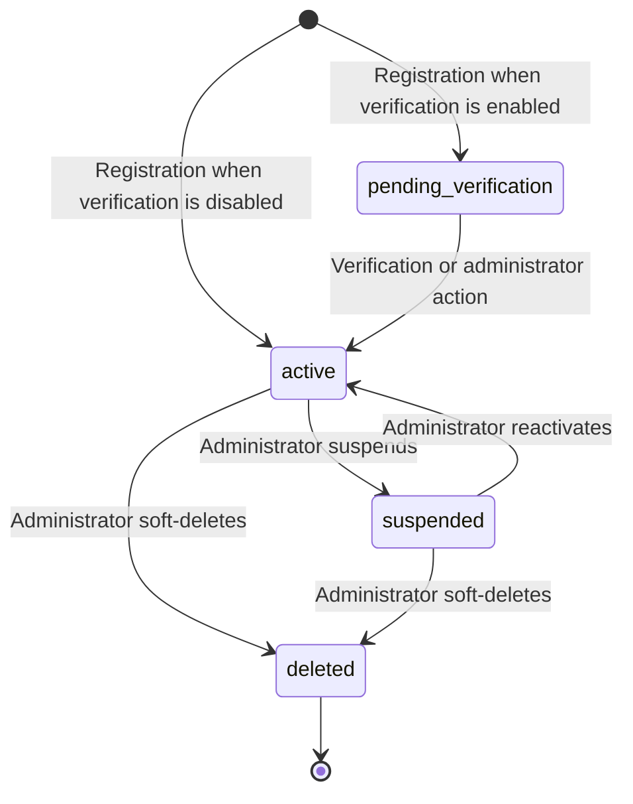
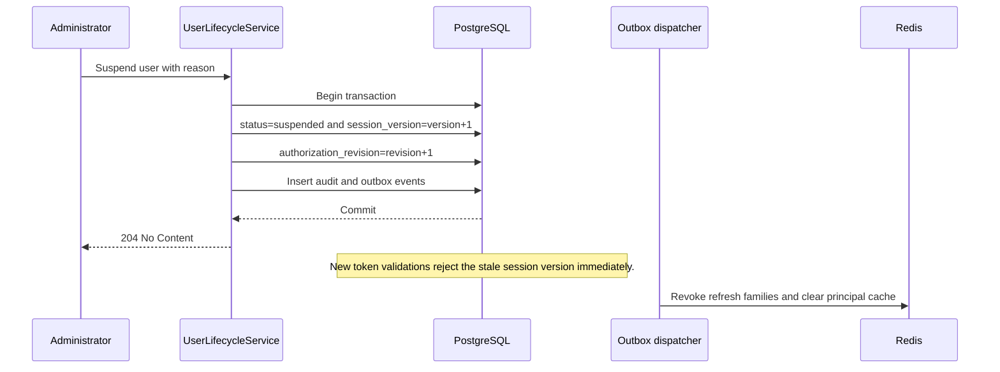

# IAM phase 1 and phase 2 design

**Status:** implemented

**Audience:** maintainers, backend engineers, security reviewers, and API consumers

**Scope:** IAM phase 1 (safe authorization administration) and phase 2 (account and session lifecycle)

## Executive summary

The application already has a solid authorization baseline: default-deny routing,
permission checks, typed JWT claims, role/permission persistence, atomic
refresh-token rotation, and revisioned Redis principal caching.

Before IAM is exposed as an administration surface, it needs a durable source of
truth for revocation, explicit assignment operations, protection for system
roles, and an audit trail. Phase 1 delivers those authorization controls.
Phase 2 adds persisted account lifecycle and session-version enforcement.

The target rule is simple:

> PostgreSQL determines whether an account is active and which authorization
> revision is current. Redis accelerates principal loading and refresh-token
> rotation, but cannot be the only system that makes a revocation effective.

### Implementation record

The application implementation now includes:

- Database-backed account status, authorization revision, and session version.
- Strict `sv` claims on access and refresh tokens, with a narrow authoritative
  account-state query before principal-cache use.
- Immutable system roles, a static permission catalogue, explicit replacement
  APIs, central grant policy, and deterministic 403/409/422 domain errors.
- Transactional authorization revisions, append-only audit events, and a
  retrying `FOR UPDATE SKIP LOCKED` outbox dispatcher.
- Suspend, activate, soft-delete, administrator/session revocation, and
  self-service password-change operations.
- Configurable asynchronous bcrypt hashing and durable revoke-all semantics.

Pending verification remains disabled until a verification workflow exists.
Processed-outbox retention, external audit export, dashboards, and alerts are
deployment concerns and remain intentionally outside the application API.

## Contents

- [Goals, non-goals, and decisions](#goals-non-goals-and-decisions)
- [Current design](#current-design)
- [Target architecture](#target-architecture)
- [Phase 1: safe IAM administration](#phase-1-safe-iam-administration)
- [Phase 2: account and session lifecycle](#phase-2-account-and-session-lifecycle)
- [Cross-cutting contracts](#cross-cutting-contracts)
- [Migration and rollout](#migration-and-rollout)
- [Verification plan](#verification-plan)
- [Implementation decisions](#implementation-decisions)

## Goals, non-goals, and decisions

### Goals

- Prevent IAM users from granting authority they do not control.
- Provide explicit user-role and direct-permission assignment operations.
- Apply role/permission revocations on the next protected request.
- Protect built-in roles and the permission catalogue.
- Audit every authorization mutation.
- Support suspend, reactivate, soft-delete, password change, and revoke-all
  sessions.
- Retain cached permission evaluation without making Redis authoritative.

### Non-goals

- An external identity provider, SSO, or SCIM provisioning.
- Tenant-specific or relationship-based authorization.
- A web administration UI.
- Changing bearer-token transport.

### Chosen decisions

| Concern                 | Decision                                            | Reason                                                                                                                                              |
| ----------------------- | --------------------------------------------------- | --------------------------------------------------------------------------------------------------------------------------------------------------- |
| Permission catalogue    | Code-owned and static                               | Route decorators currently reference the TypeScript permission enum; a dynamic database catalogue creates a second vocabulary no route can enforce. |
| Roles                   | Database-owned; selected roles are system-protected | Custom roles are useful, while built-in roles need lifecycle protection.                                                                            |
| Authorization authority | PostgreSQL                                          | Permission revocation and suspension cannot wait for a Redis retry.                                                                                 |
| Redis                   | Principal cache and refresh-token-family store      | It improves latency but is not the source of account state or authorization revision.                                                               |
| IAM publication         | Transactional outbox                                | A committed database change must not appear failed because cache/event delivery fails.                                                              |
| Direct permissions      | Retained as an exception path                       | They support operational exceptions but require stricter policy and audit controls than roles.                                                      |

## Current design

### Current high-level design



### Current authorization data model



### Current request flow

1. JwtStrategy verifies an access token.
2. It reads a user authorization-cache generation from Redis.
3. It returns the cached UserEntity, or loads the user with roles, role
   permissions, and direct permissions from PostgreSQL.
4. UserSubscriber derives computedPermissions.
5. PermissionsGuard requires every permission declared by Auth.

### Current-versus-proposed summary

| Area                 | Current behavior                                    | Proposed behavior                                                                 |
| -------------------- | --------------------------------------------------- | --------------------------------------------------------------------------------- |
| Role mutation        | role:manage can attach any permission               | Permission changes require policy approval and permission:assign.                 |
| Permission catalogue | Enum seed and public creation endpoint coexist      | Catalogue is static and code-reviewed; the creation endpoint is removed.          |
| Assignment           | No dedicated user-role/direct-permission operations | Explicit replacement operations, policy checks, audit, and revision changes.      |
| System roles         | No role-level protection                            | isSystem blocks normal update/delete.                                             |
| Role deletion        | Assigned-role FK becomes a database error           | 409 conflict with member count and reassignment path.                             |
| Cache invalidation   | Redis is updated after commit                       | Database revision changes in the transaction; outbox cleans Redis asynchronously. |
| Account state        | isActive is a DTO-only value                        | Persisted status is checked at login, refresh, and protected access.              |
| Revoke all sessions  | Not available                                       | Durable sessionVersion invalidates every access and refresh token.                |
| Audit                | No immutable history                                | Append-only audit event and transactional outbox records.                         |

### Current mutation failure mode



## Target architecture

### Target high-level design



### Target authorization invariant

Every protected request establishes the following facts before it trusts a
cached principal:

1. The account status is active.
2. The access-token session version equals the current database session version.
3. The principal cache key uses the current database authorization revision.

The application performs a narrow primary-key query for account access state.
It then uses Redis only to avoid loading the full role/permission graph on every
request.



### Target data model



## Phase 1: safe IAM administration

### Scope

Phase 1 delivers:

- Create and update custom roles.
- Replace a user's roles.
- Replace a user's direct permissions.
- Read roles, permissions, and audit events.
- Protect system roles and the static permission catalogue.
- Advance affected users' authorization revisions in the same transaction as an
  IAM mutation.
- Insert audit and outbox records in that transaction.

It does not expose permission creation. A new permission requires a pull request
that updates the enum, description map, seed, tests, and any route declarations.

### Proposed API surface

| Endpoint                              | Route permission                                      | Primary behavior                                             |
| ------------------------------------- | ----------------------------------------------------- | ------------------------------------------------------------ |
| POST /iam/roles                       | role:manage                                           | Create a non-system custom role.                             |
| PATCH /iam/roles/:id                  | role:manage; permission:assign for permission changes | Update role metadata and, when allowed, replace permissions. |
| DELETE /iam/roles/:id                 | role:manage                                           | Delete only non-system roles without assigned users.         |
| PUT /iam/users/:id/roles              | role:assign                                           | Replace every assigned role atomically.                      |
| PUT /iam/users/:id/direct-permissions | permission:assign                                     | Replace every direct permission atomically.                  |
| GET /iam/audit-events                 | audit:read                                            | Read filtered, redacted IAM history.                         |

Replacement semantics are intentional. The submitted list is the complete
desired state, making an audit diff and retry idempotent. Add/remove endpoints
can be added later only if a caller has a concrete concurrency requirement.

### Authorization matrix

| Operation                | Controller requirement            | IamPolicyService requirement                                                                                                                                  |
| ------------------------ | --------------------------------- | ------------------------------------------------------------------------------------------------------------------------------------------------------------- |
| Create empty custom role | role:manage                       | Actor may create a non-system role.                                                                                                                           |
| Change role permissions  | role:manage and permission:assign | Every granted permission is within the actor's grantable set.                                                                                                 |
| Assign role              | role:assign                       | Each assigned role is assignable by the actor. Its effective permissions are a subset of the actor's grantable permissions unless break-glass policy applies. |
| Assign direct permission | permission:assign                 | Each permission is within the actor's grantable set.                                                                                                          |
| Delete role              | role:manage                       | Role is not system and has zero members.                                                                                                                      |
| Read audit               | audit:read                        | Redact sensitive fields based on viewer authority.                                                                                                            |

A system administrator bypass is a central policy decision, not a string
comparison scattered through controllers. It is recorded in the audit event.

### Low-level module design



Suggested layout:

```
src/modules/iam/
  dto/
    replace-user-roles.dto.ts
    replace-user-direct-permissions.dto.ts
    iam-mutation-reason.dto.ts
  iam.controller.ts
  iam-policy.service.ts
  iam-mutation.service.ts
  authorization-revision.service.ts
src/modules/audit/
  audit-event.entity.ts
  audit.service.ts
src/modules/outbox/
  outbox-event.entity.ts
  outbox.service.ts
  outbox-dispatcher.service.ts
```

### Command contracts

```ts
interface ReplaceUserRolesCommand {
  actorId: Uuid;
  userId: Uuid;
  roleIds: Uuid[];
  reason?: string;
  correlationId: string;
}

interface ReplaceUserDirectPermissionsCommand {
  actorId: Uuid;
  userId: Uuid;
  permissionIds: Uuid[];
  reason?: string;
  correlationId: string;
}

interface AuthorizationChangedEvent {
  type: 'authorization.changed';
  userIds: Uuid[];
  cause: 'role.updated' | 'role.assigned' | 'direct-permissions.replaced';
  occurredAt: string;
}
```

The controller derives actor ID and correlation ID from trusted request context.
They must not be accepted from the request body.

### IAM mutation algorithm

Every mutation uses one CLS transaction:

1. Load actor authority, target state, and requested roles/permissions.
2. Reject duplicate or missing IDs with 422.
3. Run IamPolicyService checks.
4. Apply the relation or role update.
5. Determine every affected user.
6. Increment users.authorization_revision for every affected user.
7. Insert an append-only audit event.
8. Insert an outbox event.
9. Commit and return the result.
10. Dispatch the outbox asynchronously to clear obsolete Redis keys and publish
    integration notifications.

The database revision is the correctness mechanism. Redis invalidation is
cleanup and observability, not a required step in the request response.

### Role-permission update sequence



### Data and validation rules

| Condition                              | Response                   | Reason                                         |
| -------------------------------------- | -------------------------- | ---------------------------------------------- |
| System role update/delete              | 403                        | System roles are deployment policy.            |
| Role has assigned users on delete      | 409 with member count      | Reassignment/removal must be explicit.         |
| Missing role/permission ID             | 422 with invalid IDs       | Never silently create a partial configuration. |
| Duplicate submitted ID                 | 422                        | Keep replacement semantics deterministic.      |
| Permission outside grantable set       | 403                        | Prevent privilege escalation.                  |
| Static permission create/update/delete | 404 after endpoint removal | The code catalogue is authoritative.           |

### Outbox contract

The outbox supports cache cleanup, downstream notification, and external audit
export. It does not decide whether authorization changes are effective.

- Claim events with FOR UPDATE SKIP LOCKED.
- Retry with bounded exponential backoff.
- Store attempt count and last error.
- Make consumers idempotent with the outbox event ID.
- Alert on an event older than the delivery service-level objective.
- Retain processed events for an agreed replay window before archival.

## Phase 2: account and session lifecycle

### Scope

Phase 2 adds:

- Suspend, reactivate, and soft-delete account state.
- Revoke all sessions for a user.
- Password-change/reset session revocation.
- Login, refresh, and protected-request enforcement of account state.
- A durable session version in JWT claims.

### Account state model



Do not enable pending verification until an actual mail-verification workflow
exists. Existing users are backfilled as active.

### User persistence and claim changes

```ts
enum AccountStatus {
  ACTIVE = 'active',
  SUSPENDED = 'suspended',
  PENDING_VERIFICATION = 'pending_verification',
  DELETED = 'deleted',
}

// Added to UserEntity
status: AccountStatus;
authorizationRevision: number;
sessionVersion: number;
suspendedAt?: Date | null;
suspendedReason?: string | null;
deletedAt?: Date | null;

// Required on both strict access and refresh token claims
sv: number;
```

- authorizationRevision changes when roles or direct permissions change.
- sessionVersion changes when every current credential must be rejected:
  suspension, deletion, password change/reset, and revoke-all-sessions.
- The current roles claim is informational only. Remove it if no client needs
  role labels; the guard must continue to use the server-side principal.

### Account access-state service

```ts
interface AccountAccessState {
  userId: Uuid;
  status: AccountStatus;
  sessionVersion: number;
  authorizationRevision: number;
}

interface AccountAccessStateService {
  getRequiredActiveState(userId: Uuid): Promise<AccountAccessState>;
}
```

This service runs a narrow primary-key query. It must not use a stale Redis
value for status or versions. Missing, inactive, and stale-session cases all
return external 401 responses from token endpoints to avoid account-state
disclosure.

### Lifecycle API

| Endpoint                            | Authority                                                             | Result                                                                           |
| ----------------------------------- | --------------------------------------------------------------------- | -------------------------------------------------------------------------------- |
| POST /iam/users/:id/suspend         | user:update plus policy approval                                      | Set suspended, increment session/authz versions, write audit/outbox.             |
| POST /iam/users/:id/activate        | user:update plus policy approval                                      | Set active and audit.                                                            |
| POST /iam/users/:id/revoke-sessions | user:update for another user; dedicated self-service route for caller | Increment session version and revoke Redis refresh families.                     |
| POST /auth/change-password          | Authenticated user                                                    | Check current password, update hash, increment session version, revoke families. |
| DELETE /iam/users/:id               | user:delete plus policy approval                                      | Soft-delete, increment versions, revoke sessions, audit.                         |

### Suspend-account sequence



### Refresh and logout behavior

| Situation                              | Result                                                                                                                |
| -------------------------------------- | --------------------------------------------------------------------------------------------------------------------- |
| Refresh token session version is stale | 401; do not rotate; best-effort revoke the family.                                                                    |
| Account is suspended/deleted/pending   | 401; do not rotate; best-effort revoke the family.                                                                    |
| Refresh replay                         | Preserve atomic family revocation and return 401.                                                                     |
| Logout current session                 | Preserve family-only revocation. Access token expires naturally unless a later session-version change invalidates it. |
| Revoke all sessions                    | Increment durable sessionVersion; every access and refresh token fails at next validation.                            |

### Password operations

- Replace bcrypt.hashSync with asynchronous bcrypt hashing.
- Keep the work factor in validated configuration and benchmark it in the
  deployment environment.
- Require the current password for self-service changes unless a separate reset
  credential has been verified.
- Never log passwords, reset credentials, JWTs, or refresh-token hashes.
- Treat a password change/reset as revoke-all-sessions.

## Cross-cutting contracts

### Error contract

| Application code           | HTTP                  | Example                                            |
| -------------------------- | --------------------- | -------------------------------------------------- |
| IAM_SYSTEM_ROLE_PROTECTED  | 403                   | Attempt to change a seeded system role.            |
| IAM_GRANT_NOT_ALLOWED      | 403                   | Actor grants a permission outside their authority. |
| IAM_ROLE_HAS_MEMBERS       | 409                   | Attempt to delete an assigned role.                |
| IAM_UNKNOWN_PERMISSION_IDS | 422                   | Role request references missing permissions.       |
| IAM_UNKNOWN_ROLE_IDS       | 422                   | Assignment references missing roles.               |
| ACCOUNT_NOT_ACTIVE         | 401 at token boundary | Do not disclose suspension/deletion state.         |

Database constraint names must not be exposed as the public contract.

### Audit event shape

```json
{
  "action": "iam.user_roles.replaced",
  "actorId": "uuid",
  "subjectType": "user",
  "subjectId": "uuid",
  "before": { "roleIds": ["uuid"] },
  "after": { "roleIds": ["uuid", "uuid"] },
  "reason": "Approved support escalation 1234",
  "correlationId": "request-id",
  "createdAt": "2026-07-13T00:00:00.000Z"
}
```

Audit records are append-only to ordinary application code. Retention or deletion
must be a privileged operational policy, not an IAM endpoint.

### Performance budget

| Operation                               | Storage work                                                   | Intent                                           |
| --------------------------------------- | -------------------------------------------------------------- | ------------------------------------------------ |
| Protected request with warm cache       | One primary-key account-state query and one Redis get          | Avoid loading role joins.                        |
| Protected request with cold cache       | State query, role graph load, Redis set                        | Cache by current authorization revision.         |
| User role/direct-permission replacement | Relation replacement, one revision update, audit/outbox writes | One transaction.                                 |
| Role permission update                  | Role update, member revision bulk update, audit/outbox writes  | Batch/maintenance workflow for huge memberships. |

If a role has a very large membership, do not accept a security window where
revocation is only eventually applied. Use a controlled maintenance workflow or
a design that can update revisions within the required enforcement window.

### Resource-level authorization

These phases are route-level RBAC plus direct permissions. When ownership/team
rules arrive, add a policy/ability layer at the use-case boundary. Do not encode
ownership into role names or global route decorators.

## Migration and rollout

### Migration order

1. Add roles.is_system, users.status, users.authorization_revision,
   users.session_version, and lifecycle timestamps with safe defaults.
2. Add audit_events and outbox_events with indexes.
3. Mark built-in seeded roles/permissions as system-owned.
4. Deploy services that write revisions, audit events, and outbox events while
   retaining existing authorization reads.
5. Add AccountAccessStateService and the strict JWT sv claim.
6. Issue only versioned tokens; use a short announced compatibility window,
   then require reauthentication for old tokens.
7. Add IAM assignment/lifecycle APIs and remove permission creation.
8. Enable dashboards, alerts, and outbox replay runbooks.

### Backward compatibility

- Existing users start active with authorizationRevision and sessionVersion set
  to 1.
- Tokens without sv need an explicitly time-bounded migration window.
- Clients must treat 401 after suspension, password change, and revoke-all as a
  normal reauthentication event.
- Removing permission creation is a documented breaking API change.

### Rollback

- Additive columns and audit/outbox tables are safe to retain after a code
  rollback.
- Do not roll back version enforcement after a suspension/revocation event; it
  could resurrect credentials.
- Outbox consumers must be idempotent so replay is safe.

## Verification plan

### Unit tests

- IamPolicyService rejects grants outside the actor grantable set.
- System roles cannot be modified/deleted.
- Missing and duplicate IDs produce expected domain errors.
- Revision services update exactly affected users.
- AccountAccessStateService rejects every inactive state.
- Access/refresh JWT schemas reject missing or invalid sv claims.

### PostgreSQL and Redis integration tests

- Assigned-role deletion returns 409.
- Updating a role advances database authorization revisions for all members.
- An affected user receives new permissions on the next protected request even
  when an old Redis principal exists.
- Redis failure after commit does not make a committed IAM change appear rolled
  back; outbox delivery retries.
- Suspension and revoke-all reject current access/refresh tokens at next
  validation.
- Password change revokes all refresh families.
- Audit/outbox rows commit or roll back with their IAM mutation.

### API contract and operational checks

- OpenAPI documents 403, 409, and 422 IAM responses.
- Permission creation is absent from the static-catalogue API.
- Assignment/lifecycle routes declare their required permissions.
- Dashboards expose IAM mutation rate, denied grants, outbox age, dispatcher
  errors, suspended-account attempts, and refresh replay.
- Runbooks document audit lookup, outbox replay, user suspension, and first
  administrator recovery.

## Implementation decisions

1. Seeded system roles are immutable through the API. Changes require a
   reviewed deployment/seed change.
2. Direct permissions remain an audited exception path guarded by the same
   no-privilege-escalation policy as role permissions.
3. Pending verification is represented in the data model but is not assigned
   until a real verification workflow exists.
4. IAM audit snapshots contain identifiers and lifecycle state only; passwords,
   tokens, hashes, and credentials are never recorded. Retention is an
   operational policy.
5. Resource ownership remains a future use-case policy layer. It must not be
   encoded into global role names.
